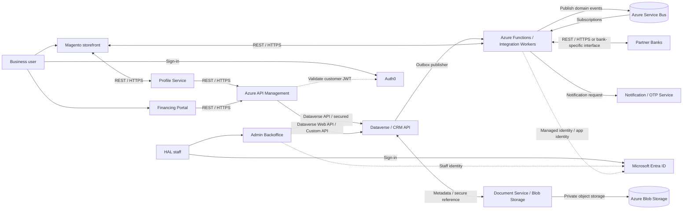
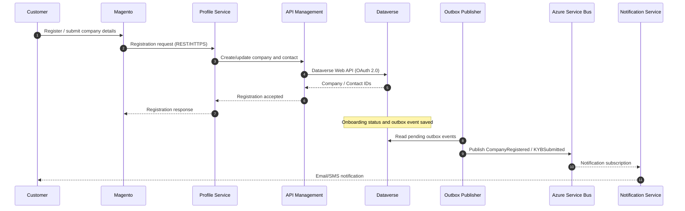

# Architecture diagrams

## System context and integration landscape

```mermaid

flowchart LR
    Customer[Business user]
    Staff[HAL staff]

    Magento[Magento storefront]
    Profile[Profile Service]
    Finance[Financing Portal]
    Backoffice[Admin Backoffice]

    APIM[Azure API Management]
    CRM[Dataverse / CRM API]
    Bus[(Azure Service Bus)]
    Worker[Azure Functions / Integration Workers]
    Docs[Document Service / Blob Storage]
    Banks[Partner Banks]
    Notify[Notification / OTP Service]
    Auth0[Auth0]
    Entra[Microsoft Entra ID]

    Customer -->|Sign-in| Auth0
    Staff -->|Sign-in| Entra

    Customer --> Magento
    Customer --> Finance
    Staff --> Backoffice

    Magento <-->|REST / HTTPS| Profile
    Profile -->|REST / HTTPS| APIM
    Finance -->|REST / HTTPS| APIM
    Backoffice -->|Dataverse API / secured app| CRM
    APIM -->|Dataverse Web API / Custom API| CRM

    CRM -->|Outbox publisher| Worker
    Worker -->|Publish domain events| Bus
    Bus -->|Subscriptions| Worker

    Worker <-->|REST / HTTPS| Magento
    Worker <-->|REST / HTTPS or bank-specific interface| Banks
    Worker -->|Notification request| Notify
    CRM <-->|Metadata / secure reference| Docs
    Docs -->|Private object storage| Blob[(Azure Blob Storage)]

    APIM -.->|Validate customer JWT| Auth0
    Backoffice -.->|Staff identity| Entra
    Worker -.->|Managed identity / app identity| Entra

```

## Registration and event publication sequence

```mermaid

sequenceDiagram
    autonumber
    participant C as Customer
    participant M as Magento
    participant P as Profile Service
    participant A as API Management
    participant D as Dataverse
    participant O as Outbox Publisher
    participant S as Azure Service Bus
    participant N as Notification Service

    C->>M: Register / submit company details
    M->>P: Registration request (REST/HTTPS)
    P->>A: Create/update company and contact
    A->>D: Dataverse Web API (OAuth 2.0)
    D-->>A: Company / Contact IDs
    A-->>P: Registration accepted
    P-->>M: Registration response
    Note over D: Onboarding status and outbox event saved
    O->>D: Read pending outbox events
    O->>S: Publish CompanyRegistered / KYBSubmitted
    S-->>N: Notification subscription
    N-->>C: Email/SMS notification

```
