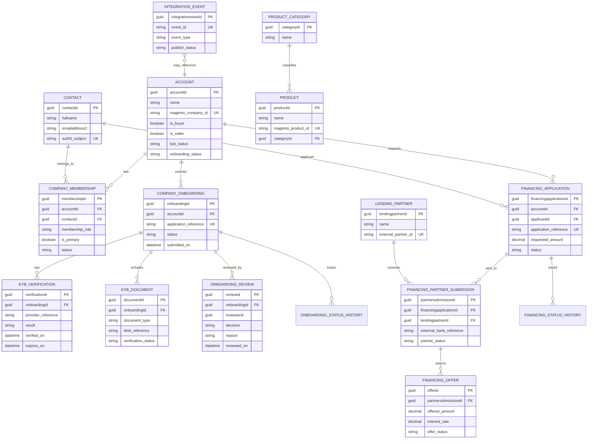

# Architecture diagrams

## Dataverse entity relationship diagram

```mermaid

erDiagram
    ACCOUNT ||--o{ COMPANY_MEMBERSHIP : has
    CONTACT ||--o{ COMPANY_MEMBERSHIP : belongs_to
    ACCOUNT ||--o{ COMPANY_ONBOARDING : submits
    COMPANY_ONBOARDING ||--o{ KYB_VERIFICATION : has
    COMPANY_ONBOARDING ||--o{ KYB_DOCUMENT : includes
    COMPANY_ONBOARDING ||--o{ ONBOARDING_REVIEW : reviewed_by
    COMPANY_ONBOARDING ||--o{ ONBOARDING_STATUS_HISTORY : tracks
    ACCOUNT ||--o{ FINANCING_APPLICATION : requests
    CONTACT ||--o{ FINANCING_APPLICATION : applicant
    FINANCING_APPLICATION ||--o{ FINANCING_PARTNER_SUBMISSION : sent_to
    LENDING_PARTNER ||--o{ FINANCING_PARTNER_SUBMISSION : receives
    FINANCING_PARTNER_SUBMISSION ||--o{ FINANCING_OFFER : returns
    FINANCING_APPLICATION ||--o{ FINANCING_STATUS_HISTORY : tracks
    PRODUCT_CATEGORY ||--o{ PRODUCT : classifies
    INTEGRATION_EVENT }o--|| ACCOUNT : may_reference

    ACCOUNT {
      guid accountid PK
      string name
      string magento_company_id UK
      boolean is_buyer
      boolean is_seller
      string kyb_status
      string onboarding_status
    }
    CONTACT {
      guid contactid PK
      string fullname
      string emailaddress1
      string auth0_subject UK
    }
    COMPANY_MEMBERSHIP {
      guid membershipid PK
      guid accountid FK
      guid contactid FK
      string membership_role
      boolean is_primary
      string status
    }
    COMPANY_ONBOARDING {
      guid onboardingid PK
      guid accountid FK
      string application_reference UK
      string status
      datetime submitted_on
    }
    KYB_VERIFICATION {
      guid verificationid PK
      guid onboardingid FK
      string provider_reference
      string result
      datetime verified_on
      datetime expires_on
    }
    KYB_DOCUMENT {
      guid documentid PK
      guid onboardingid FK
      string document_type
      string blob_reference
      string verification_status
    }
    ONBOARDING_REVIEW {
      guid reviewid PK
      guid onboardingid FK
      guid reviewerid
      string decision
      string reason
      datetime reviewed_on
    }
    FINANCING_APPLICATION {
      guid financingapplicationid PK
      guid accountid FK
      guid applicantid FK
      string application_reference UK
      decimal requested_amount
      string status
    }
    LENDING_PARTNER {
      guid lendingpartnerid PK
      string name
      string external_partner_id UK
    }
    FINANCING_PARTNER_SUBMISSION {
      guid partnersubmissionid PK
      guid financingapplicationid FK
      guid lendingpartnerid FK
      string external_bank_reference
      string partner_status
    }
    FINANCING_OFFER {
      guid offerid PK
      guid partnersubmissionid FK
      decimal offered_amount
      decimal interest_rate
      string offer_status
    }
    PRODUCT {
      guid productid PK
      string name
      string magento_product_id UK
      guid categoryid FK
    }
    PRODUCT_CATEGORY {
      guid categoryid PK
      string name
    }
    INTEGRATION_EVENT {
      guid integrationeventid PK
      string event_id UK
      string event_type
      string publish_status
    }

```
